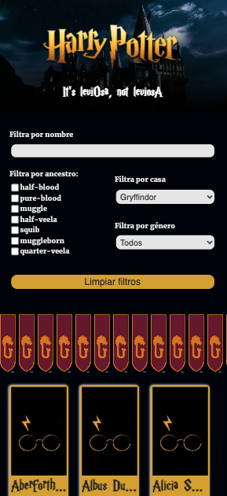
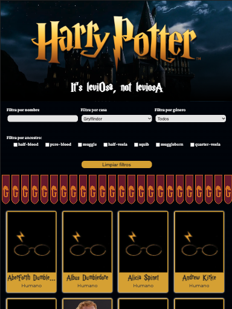
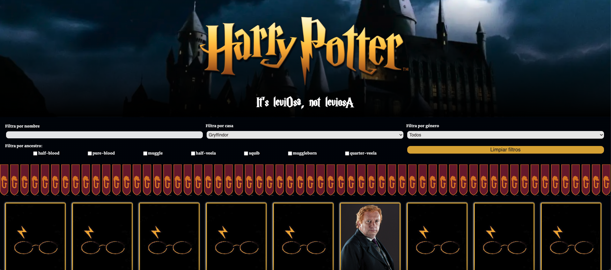

<h1 align="center">Harry Potter's characters</h1>


---

<div align="center">
   Solution for exrcise of module 3's final evaluation by Olga Rodríguez Garrucho at <a href="https://adalab.es/">
     Adalab
    </a>.
</div>

<div align="center">
  <h3>
    <a href=./src/images/demo.gif>
      Demo
    </a>
    <span> | </span>
    <a href="beta.adalab.es/modulo-3-evaluacion-final-olguita2412/">
      Solution
    </a>
  </h3>
</div>

---

## Table of Contents

- [General Info](#general-info)
- [Technologies](#technologies)
- [Installation](#installation)
- [Result](#result)
- [Contact](#contact)
- [License](#license)

---

## General Info

Solution for exercise of module 3´s final evaluation by Olga Rodríguez Garrucho.

Develop a web application to search for Harry Potter's characters with some filters and a card of character's details.

Use of HTML, SASS and JSX.

The application has some inputs (text, select and checkbox) for search and a button to clean the search. When the user chooses one or more filters, in the bottom list (result list) appear the characters that meet those filters.

The characters come from the API once on page load, then all the characters are saved in local storaged.

The result list shows a default list with default filters of house (Gryffindor) and gender (All).

If the user filters and click on a character, it shows a details card of this character with the photo, name, some description and his house emblem. Also it shows a button to return to home page and to see again the result list with de user's filters.

The reset button cleans the search inputs and show the result list with default filters.


### Web responsive mobile:



### Web responsive tablet:



### Web responsive desktop:



### Demo:


---

## Technologies

- [Visual Studio Node](https://code.visualstudio.com/download) Version: May 2022
- [Git](https://git-scm.com/download/mac) Version: 2.36.1
- [Node JS](https://nodejs.org/es/download/) Version: v14.19.3
- [React Started Kit]()
- [Git Hub](https://github.com/)

---

## Installation

For open the exercise it´s necesary to do the next steps:

```
$ git clone https://github.com/Adalab/modulo-3-evaluacion-final-olguita2412.git
$ cd ../path/to/the/file
$npm install
$npm start
```

---

## Result

To view the final´s result of exercise click [here](beta.adalab.es/modulo-3-evaluacion-final-olguita2412/).

---

## Contact

- Linkedin [@olguita2412](https://{https://www.linkedin.com/in/olguita2412/})
- GitHub [@olguita2412](https://{github.com/olguita2412})
- Twitter [@olguiita24](https://{twitter.com/olguiita24})

---

## License

Copyright (c) 2022, Olga RG.

